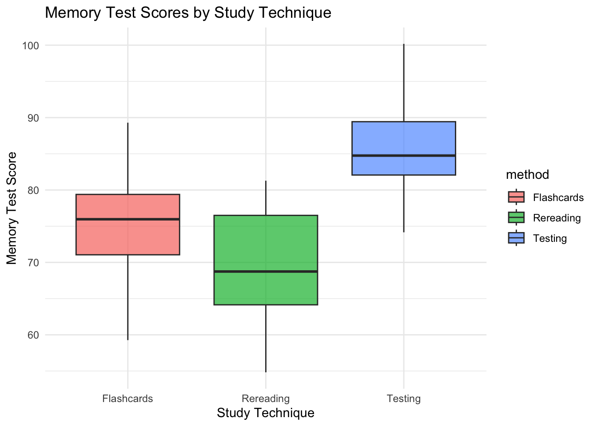

# ANOVA

## Introduction

Picture this: You just ran an experiment and had three groups. You want to see if they performed differently, but do not know how. You learned in the last chapter that if we had two groups, we could run a t.test, but now you have one more. This sounds like the perfect opportunity to run an **Analysis of Variance** (ANOVA). An **ANOVA** tests whether the means of three or more groups are significantly different from one another. It does this by comparing the variance between groups to the variance within groups.

In this lesson, we will explore how to use **ANOVAs** to answer the question:

> *How do studying methods influence memory scores?*

We will create a dataset called `memory`, which includes students’ method of studying and their memory scores.


**Learning Objectives**

By the end of this chapter, you will be able to:
- Create a reproducible dataset in R.
- Conduct one-way and two-way ANOVAs.
- Interpret ANOVA output (F, p, SS, MS).
- Run post-hoc comparisons with Tukey’s HSD.
- Compare models using AIC.


## Creating Our Data

In this chapter, we are not going to be loading any previously captured data. Instead, we will be utilizing R to help create our own data. Our data is going to contain two variables:

1. method: identified their studying methods, either flashcards, rereading the material, or taking practice tests
2. score: how well they scored on a memory test after studying.

With our focus being reproducibility, how can we manage to make sure that the data we create here is the same data you will create? In R, we do this by using the `set.seed` command. What this does is makes sure the "random" data creation is the same no matter who is creating the data.

Imagine we had a deck of cards. We need to shuffle them before we deal them to our players. `set.seed` is the equivalent to that deck of cards being shuffled in a specific order, that way, if it is shuffled that way every single time, each player is going to be dealt the same cards. As long as we put the same number in `set.seed` then the same data will be created.

Next, we can use the `rnorm` command to dictate quantity, mean, and standard deviation of each.

``` r
library(tidyverse)

set.seed(123)  # ensures reproducibility


memory <- tibble(
  method = rep(c("Flashcards", "Rereading", "Testing"), each = 20),
  score = c(
    rnorm(20, mean = 75, sd = 8),  # Flashcards group
    rnorm(20, mean = 70, sd = 9),  # Rereading group
    rnorm(20, mean = 85, sd = 7)   # Testing group
  )
)

glimpse(memory)
#> Rows: 60
#> Columns: 2
#> $ method <chr> "Flashcards", "Flashcards", "Flashcards", "…
#> $ score  <dbl> 70.51619, 73.15858, 87.46967, 75.56407, 76.…
head(memory)
#> # A tibble: 6 × 2
#>   method     score
#>   <chr>      <dbl>
#> 1 Flashcards  70.5
#> 2 Flashcards  73.2
#> 3 Flashcards  87.5
#> 4 Flashcards  75.6
#> 5 Flashcards  76.0
#> 6 Flashcards  88.7
```
We have successfully created our first dataset!

## Descriptive Statistics
Now that we have our data, let us do some digging to get some descriptive statistics regarding central tendency. As done before, we can create a summarized table, or we can utilize the `favstats` command from the library(mosaic)

``` r
# Creating a summarizing table
memory_summarized<- memory %>%
  group_by(method) %>%
  summarize(
    mean_score = mean(score),
    sd_score = sd(score),
    n = n()
  )
memory_summarized
#> # A tibble: 3 × 4
#>   method     mean_score sd_score     n
#>   <chr>           <dbl>    <dbl> <int>
#> 1 Flashcards       76.1     7.78    20
#> 2 Rereading        69.5     7.47    20
#> 3 Testing          85.7     6.70    20

# Instead of writing all of the code manually, we can use the code below.
library(mosaic)
favstats(score ~ method, data = memory)
#>       method      min       Q1   median       Q3       max
#> 1 Flashcards 59.26706 71.05157 75.95988 79.38981  89.29531
#> 2  Rereading 54.81976 64.14098 68.74051 76.49688  81.28433
#> 3    Testing 74.15873 82.06821 84.75004 89.43416 100.18269
#>       mean       sd  n missing
#> 1 76.13299 7.781323 20       0
#> 2 69.53869 7.469448 20       0
#> 3 85.74540 6.701384 20       0
```
Some things we now see:

1. Testing has the highest minimum and maximum values in comparison to the other two methods
2. Testing has the highest median
3. Testing has the highest mean.
4. Testing has the lowest standard deviation
5. There are no missing values

These are early indications that testing is the best studying method if we want the highest memory scores.

## Visualizing Relationships
When we have categorical and numeric data, there are two visualizations that are extremely relevant when visualizing our data: boxplots and bar charts.

``` r
ggplot(memory, aes(x = method, y = score, fill = method)) +
  geom_boxplot(alpha = 0.7) +
  labs(
    title = "Memory Test Scores by Study Technique",
    x = "Study Technique",
    y = "Memory Test Score"
  ) +
  theme_minimal()
```



``` r

memory %>%
  group_by(method) %>%
  summarize(mean_score = mean(score)) %>%
  ggplot(aes(x = method, y = mean_score, fill = method)) +
  geom_col() +
  geom_text(aes(label = round(mean_score, 1)), vjust = -0.5) + # adds the means on top of each bar
  labs(
    title = "Average Memory Score by Study Technique (ANOVA Means)",
    x = "Study Technique",
    y = "Average Score"
  ) +
  theme_minimal()
```


## Running a T.Test
Last chapter, we learned how to run a t.test to better understand the difference in means between two groups. If we try to run a t.test on our data now...

``` r
# Last chapter we learned how to run a t.test. Let's try it out now.
try(t.test(score ~ method, data = memory))
#> Error in t.test.formula(formula, data = data, ...) : 
#>   grouping factor must have exactly 2 levels
```
It does not work! The reason being is that while t.test compare means, they are only able to calculate the difference between **two** means. When there are more than two, t.test fail. We must instead conduct an *ANOVA.*

## One-Way ANOVA
We have some idea, from both our visuals and descriptive statistics that the testing studying technique is better than the other two. However, while we do know that the means are different, we do not know if the difference between the means of the three techniques is statistically significant or not. We can not use t.tests because there are more than two groups. In order to uncover whether the difference between the studying technique means is statistically significant or not, we now conduct an ANOVA.

To do this, we can use the `aov` command which is very similar to `t.test`. The formula used is:

- dependent_variable ~ independent_variable, data= your_data.

To really bring it to the next level, we can also call the `supernova` command from the supernova package.

``` r
library(supernova)
# running an anova
anova_model <- aov(score ~ method, data = memory)
summary(anova_model)
#>             Df Sum Sq Mean Sq F value   Pr(>F)    
#> method       2   2657  1328.5   24.72 1.87e-08 ***
#> Residuals   57   3064    53.8                     
#> ---
#> Signif. codes:  
#> 0 '***' 0.001 '**' 0.01 '*' 0.05 '.' 0.1 ' ' 1
supernova(anova_model)  # clearer ANOVA table
#>  Analysis of Variance Table (Type III SS)
#>  Model: score ~ method
#> 
#>                                SS df       MS      F   PRE
#>  ----- --------------- | -------- -- -------- ------ -----
#>  Model (error reduced) | 2656.938  2 1328.469 24.716 .4644
#>  Error (from model)    | 3063.753 57   53.750             
#>  ----- --------------- | -------- -- -------- ------ -----
#>  Total (empty model)   | 5720.691 59   96.961             
#>      p
#>  -----
#>  .0000
#>       
#>  -----
#> 
```
Just as the `aov` command should look similar, the output of running the anova should look familiar. Reviewing the data we get:

- Sum of Squares (SS): the total amount of variation explained by each source
  - Method SS - the amount of variation explained by the studying method - 2657
  - Residual SS- the amount of variation explained by everything other than method - 3063
  - The total is 5720, which means that **about 46% of all variation in scores is due to studying method.**
- Df: degrees of freedom
  - There are 2 degrees of freedom (3-1), since there are 3 studying methods
- Mean square: SS ÷ Df.
  - provides us with the average variability per degree of freedom.
  - Mean Method SS = 2657 / 2 = 1328.5
  - Mean Residuals SS = 3064 / 57 = 53.8
  - There is more variation explained per degree of freedom by studying method vs everything else.
- F value: how much larger the variation between groups is compared to the variation within groups
 - 24.72: there is more variation between the studying method groups than within each group.
- pr(>F): the p-value
  - It is lower than 0.05, meaning there is a statistically significant difference in memory scores based on studying technique. 
  - Hint: The number of * by the p-value indicates if it is significant or not. *** is statistically significant.

With all of that, we can now conclude that there is a statistically significant difference in memory scores due to studying technique. While this tells us that the difference is significant, it does not tell us **what the difference between the techniques is.** Through visualizations and descriptive statistics, we think testing is the best method, but it is important to make sure.

## Post-hoc Tests
To add to our ANOVA and descriptive statistics, we can run what is called *Post-hoc Tests.* These are meant to dive deeper into the ANOVA model. While an ANOVA model tells us **if** there is a statistically significant difference, Post-hoc Tests tell us **where** the difference is. The `TukeyHSD` command provides the insight.

``` r
TukeyHSD(anova_model)
#>   Tukey multiple comparisons of means
#>     95% family-wise confidence level
#> 
#> Fit: aov(formula = score ~ method, data = memory)
#> 
#> $method
#>                           diff        lwr       upr
#> Rereading-Flashcards -6.594305 -12.173359 -1.015251
#> Testing-Flashcards    9.612406   4.033352 15.191460
#> Testing-Rereading    16.206711  10.627657 21.785765
#>                          p adj
#> Rereading-Flashcards 0.0167319
#> Testing-Flashcards   0.0003304
#> Testing-Rereading    0.0000000
```
We have three different rows, with each studying technique compared to each other. The ‘diff’ column shows the mean difference between groups (Group 2 − Group 1).

- Positive = first group has a higher mean.
- Negative = first group has a lower mean.

Looking here, we can see that testing has a higher mean than both flashcards and rereading when compared against the two. We also look at the p adj, which is just the p-value. All three are statistically significant, specifically the two related to testing.

We can visualize this difference in mean comparisons using the `plot` command in base R.

``` r
plot(TukeyHSD(anova_model))
```


Taking all this into consideration:

1. Descriptive statistics show that the mean of Testing is higher than the other techniques.
2. The ANOVA results show that there is a statistically significant difference between the means of the different techniques.
3. The Post-hoc test results show that testing has higher means than Flashcards and Rereading, and that those differences are statistically significant.

All of this brings us to the conclusion: **The Testing studying technique provides the highest memory exam scores.**

## Adding a Second Factor
We have done a fantastic job of identifying the best studying technique out of the three in order to get the highest memory exam scores. In life, there are typically more than just two variables. What if there was another variable in this study? For instance, what if each person's caffeine level while studying for the memory exam was also taken into consideration. Maybe caffeine level had an influence on how well they studied, and in turn impacts their memory score. And if that is taken into account, is that a better model to use for 

To test this out, let's first create the caffeine column using a similar technique to how we created our data in the beginning.


``` r
# Let's say we also measured caffeine intake (low vs high)
set.seed(42)
memory2 <- memory %>%
  mutate(
    caffeine = rep(c("Low", "High"), times = 30)
  )

```

Now that we’ve established that study method affects memory, let’s ask a new question: does caffeine level also play a role? This moves us from a one-way ANOVA (one independent variable) to a two-way ANOVA (two independent variables, or factors)


``` r
# To see the interaction between method and caffeine levels, we add a *
anova_2 <- aov(score ~ method * caffeine, data = memory2)
summary(anova_2)
#>                 Df Sum Sq Mean Sq F value   Pr(>F)    
#> method           2 2656.9  1328.5  24.377 2.86e-08 ***
#> caffeine         1    3.4     3.4   0.063    0.803    
#> method:caffeine  2  117.4    58.7   1.077    0.348    
#> Residuals       54 2942.9    54.5                     
#> ---
#> Signif. codes:  
#> 0 '***' 0.001 '**' 0.01 '*' 0.05 '.' 0.1 ' ' 1
supernova(anova_2)
#>  Analysis of Variance Table (Type III SS)
#>  Model: score ~ method * caffeine
#> 
#>                                          SS df      MS
#>  --------------- --------------- | -------- -- -------
#>            Model (error reduced) | 2777.807  5 555.561
#>           method                 | 1746.636  2 873.318
#>         caffeine                 |   39.360  1  39.360
#>  method:caffeine                 |  117.439  2  58.720
#>            Error (from model)    | 2942.885 54  54.498
#>  --------------- --------------- | -------- -- -------
#>            Total (empty model)   | 5720.691 59  96.961
#>       F   PRE     p
#>  ------ ----- -----
#>  10.194 .4856 .0000
#>  16.025 .3725 .0000
#>   0.722 .0132 .3992
#>   1.077 .0384 .3477
#>                    
#>  ------ ----- -----
#> 
```
Interestingly, when we go to the p-values, we see that neither caffeine nor the interaction (how caffeine influences method) are statistically significant. This is a huge indication that caffeine does not have any impact on memory scores whatsoever.

The results from the ANOVA are impactful, and since we now have two different ANOVA models, we can compare the models.

## Model Comparison With AIC
Using the `aictab` from the AICcmodavg library, we can compare the one-way ANOVA model with the two-way ANOVA model to see what is the overall better model of understanding differences in memory scores.

``` r
# Compare one-way vs. two-way models
library(AICcmodavg)
model.set <- list(
  aov(score ~ method, data = memory2),
  aov(score ~ method * caffeine, data = memory2)
)
model.names <- c("One-way", "Two-way")

aictab(model.set, modnames = model.names)
#> 
#> Model selection based on AICc:
#> 
#>         K   AICc Delta_AICc AICcWt Cum.Wt      LL
#> One-way 4 414.98       0.00   0.92   0.92 -203.13
#> Two-way 7 419.99       5.01   0.08   1.00 -201.92
```
We will review model comparisons in more detail in chapter 9. For right now, we can just look at the AICc values. AIC values don’t test significance — they measure relative model quality. The general rule of thumb is that the lower the value, the better the model. In this case, the one-way ANOVA is the better model, confirming what the ANOVA results themselves also described.

## Key Takeaways

- ANOVA (Analysis of Variance) is used to compare **means across more than two groups**.  
- A **significant F-statistic** indicates that at least one group mean is different.  
- **Post-hoc tests** (like Tukey’s HSD) reveal **which** groups differ from each other.  
- The **Sum of Squares (SS)** separates total variation into between-group and within-group sources.  
- The **Mean Square (MS)** is the average variation per degree of freedom (SS ÷ df).  
- The **F value** is a ratio comparing between-group to within-group variability.  
- **Two-way ANOVA** adds an additional factor (e.g., caffeine level) to test main effects and interactions. 
- **AIC** (Akaike Information Criterion) helps compare models — *lower values indicate better fit*.  
- Always visualize your data before and after running ANOVA to confirm patterns in group means.  
- Reproducibility matters — use `set.seed()` whenever you simulate or randomize data.

---

## Checklist

**When running an ANOVA, have you:**

- [ ] Verified that your **dependent variable is numeric** and your **independent variable(s) are categorical**?  
- [ ] Created or imported your dataset reproducibly (used `set.seed()` if simulated)?  
- [ ] Summarized descriptive statistics for each group?  
- [ ] Visualized group means and distributions using boxplots or bar charts?  
- [ ] Fit your model using `aov()` or `supernova()`?  
- [ ] Interpreted the **F statistic**, **df**, and **p-value**?  
- [ ] Conducted **post-hoc tests** (e.g., `TukeyHSD`) to identify where differences lie?  
- [ ] Checked **residuals** or **assumptions** (optional but good practice)?  
- [ ] Added a **second factor** if relevant (two-way ANOVA)?  
- [ ] Compared models using **AIC** or another fit statistic?  
- [ ] Written a clear interpretation that answers your research question?

## Example APA-style write-up

A one-way analysis of variance (ANOVA) revealed a significant effect of study method on memory test scores, F(2, 57) = 24.72, p < .001. Post hoc Tukey’s HSD tests indicated that participants in the testing condition scored significantly higher than those in the flashcards and rereading conditions. Mean (± SD) scores were 75.2 (8.1) for flashcards, 69.8 (9.0) for rereading, and 84.9 (7.1) for testing, demonstrating that the testing method produced the highest memory performance.

---

> 💡 *Reproducibility Tip:*  
> Because we used `set.seed(123)` when generating the data, anyone running this chapter’s code will obtain identical results — a core principle of reproducible research.


