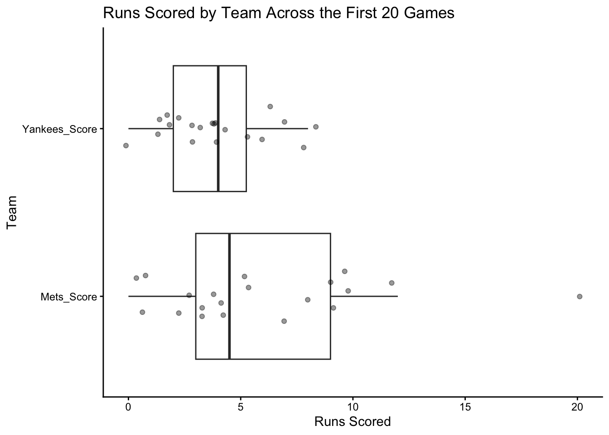

# Comparing Two Means

## Introduction
A tale as old as time. You have two different groups, and you want to really figure out not only if there is a difference, but also which is best. In New York City, this question materializes as Mets vs Yankees (Mets obviously).

When you have two different groups with a numeric data point, one of the first (and best) things to do is to **compare the two means**. There is more to uncover than just seeing if there is a difference between the actual means, which is exactly what we are going to be covering today.

## Creating a Sample Dataset
There are many different ways to get data into R. The most common are:

- Loading an excel file or CSV
- Calling data into R using an API
- Loading data from a particular package (see chapter 7)

What happens if you do not have data to insert into R? What if you want to **create** your own data in R to run analyses, merge, and graph?

R makes it very simple to do exactly that! Using the automatically installed command `data.frame` R makes it possible to make your very own data frame with whatever you want inside. Here, we are going to create two datasets:

1. mets: This is going to be a data frame with 10 rows, each row being a different game, and the number of runs scored by the *Mets* in that game.
2. yankees: This is going to be a data frame with 10 rows, each row being a different game, and the number of runs scored by the *Yankees* in that game.

In this scenario, we can imagine that for whatever reason, we are unable or do not want to upload any data to R, but instead, create the data for ourselves. We will create our tables using 2025 Major League Baseball (MLB) data, and will have two columns:

1. Game: A number representing which game it is.
2. Score: The total runs the respective team scored in that game.

To summarize, we will be taking the scores from the first 10 Yankees games and the first 10 Mets games and creating a data frame with our data.


``` r
mets <- data.frame(
  Game= c(1:10), # The colon between 1 and 10 is telling R "Hey, put all the numbers between 1 and 10 in this column.
  Mets_Score= c(4,20,12,5,3,9,9,10,4,2)) # This is where we manually put our numbers in

head(mets) # This calls the first 6 rows of the data
#>   Game Mets_Score
#> 1    1          4
#> 2    2         20
#> 3    3         12
#> 4    4          5
#> 5    5          3
#> 6    6          9

yankees <- data.frame(
  Game= c(1:10), # Same thing here
  Yankees_Score= c(3,8,2,3,2,6,5,3,2,7) # Same thing here
)

tail(yankees) # This calls the last 6 rows of the data
#>    Game Yankees_Score
#> 5     5             2
#> 6     6             6
#> 7     7             5
#> 8     8             3
#> 9     9             2
#> 10   10             7
```
Perfect! We created two different data frames, *mets* and *yankees* with each having the two columns we were looking for.

To get more practice, let's do it again, but instead, we will do it with the next ten games of the 2025 season.


``` r
mets_second_ten <- data.frame(
  Game= c(11:20),
  Mets_Score= c(10,0,7,1,8,5,3,3,4,1))

yankees_second_ten <- data.frame(
  Game= c(11:20),
  Yankees_Score= c(0,4,1,8,4,4,4,4,6,1)
)
```
Now, we successfully have datasets for the first 10 and first 20 games of the 2025 MLB season for both the Mets and the Yankees.

## Merging Data
What if we want our two datasets together?

### Binding our data
We have data for the first 20 games for the mets and yankees but they're split into the first 10 and second 10 games. What if we want to see all 20 games for each individual team? We can use a command in base R called `rbind`. The r stands for "rows" so this command is literally telling R to "bind the rows."

Note: *rbind only works when the column names in the binding datasets are the same.*

When combining datasets, no matter which method, it is imperative that we check our data before and after to make sure the combining process worked how we anticipated. In this case, each of our original datasets contain 10 rows, which means our combined datasets should have 20 rows. We will be checking using `nrow`, and any number besides 20 means that there is an issue.


``` r
# Mets
nrow(mets) # Seeing how many rows are in mets
#> [1] 10
nrow(mets_second_ten) # Seeing how many rows are in mets_second_ten
#> [1] 10
mets_all<- rbind(mets, mets_second_ten) # Combining the rows of mets and mets_second_ten
nrow(mets_all) # Seeing how many rows are in mets_all
#> [1] 20

# Yankees
nrow(yankees)
#> [1] 10
nrow(yankees_second_ten)
#> [1] 10
yankees_all<- rbind(yankees, yankees_second_ten)
```
Success! Both of our datasets have 20 rows.

### Joining Data
Our two datasets, mets_all and yankees_all now have the data from the first 20 games of the 2025 MLB season, since we successfully combined our data. Now, what if we want one dataset that had the scores of each of the first 20 games for the Mets and Yankees?

There are a few different ways to do this. The first is to use the `merge` command which is part of base R. To check that our data has merged successfully, we need to make sure there are 20 rows and 3 columns: Game, Mets_Score, and Yankees_Score.


``` r
baseball_data <- merge(yankees_all, mets_all, by = "Game")
nrow(baseball_data) # Checks the number of rows
#> [1] 20
ncol(baseball_data) # Checks the number of columns
#> [1] 3
baseball_data
#>    Game Yankees_Score Mets_Score
#> 1     1             3          4
#> 2     2             8         20
#> 3     3             2         12
#> 4     4             3          5
#> 5     5             2          3
#> 6     6             6          9
#> 7     7             5          9
#> 8     8             3         10
#> 9     9             2          4
#> 10   10             7          2
#> 11   11             0         10
#> 12   12             4          0
#> 13   13             1          7
#> 14   14             8          1
#> 15   15             4          8
#> 16   16             4          5
#> 17   17             4          3
#> 18   18             4          3
#> 19   19             6          4
#> 20   20             1          1
```
Fantastic! We now have one complete dataset with the scores of the Mets and Yankees in the first 20 games.

#### Using SQL Joins
We previously used the `merge` command, however, R also allows for SQL code! Here is a quick overview of the main joins using SQL in R:
- inner_join: Keeps only rows that match in both datasets
  - Overlap
- full_join: Keeps all rows from both datasets, matching when possible
  - Everything
- left_join: Keeps all rows from the left dataset, and matches from the right when possible
 - All left
- right_join: Keeps all rows from the right dataset, and matches from the left when possible
  - All right
- anti_join: Keeps rows from the left dataset that do NOT appear in the right
 - What's missing

In this case, we are going to use `inner_join`, since we know that both of our datasets have the same 20 games.


``` r
library(tidyverse)
#> ── Attaching core tidyverse packages ──── tidyverse 2.0.0 ──
#> ✔ dplyr     1.1.4     ✔ readr     2.1.5
#> ✔ forcats   1.0.1     ✔ stringr   1.6.0
#> ✔ ggplot2   4.0.0     ✔ tibble    3.3.0
#> ✔ lubridate 1.9.4     ✔ tidyr     1.3.1
#> ✔ purrr     1.2.0     
#> ── Conflicts ────────────────────── tidyverse_conflicts() ──
#> ✖ dplyr::filter() masks stats::filter()
#> ✖ dplyr::lag()    masks stats::lag()
#> ℹ Use the conflicted package (<http://conflicted.r-lib.org/>) to force all conflicts to become errors
baseball_data_sql <- inner_join(yankees_all, mets_all, by = "Game")
nrow(baseball_data_sql) # Checks the number of rows
#> [1] 20
ncol(baseball_data_sql) # Checks the number of columns
#> [1] 3
baseball_data_sql
#>    Game Yankees_Score Mets_Score
#> 1     1             3          4
#> 2     2             8         20
#> 3     3             2         12
#> 4     4             3          5
#> 5     5             2          3
#> 6     6             6          9
#> 7     7             5          9
#> 8     8             3         10
#> 9     9             2          4
#> 10   10             7          2
#> 11   11             0         10
#> 12   12             4          0
#> 13   13             1          7
#> 14   14             8          1
#> 15   15             4          8
#> 16   16             4          5
#> 17   17             4          3
#> 18   18             4          3
#> 19   19             6          4
#> 20   20             1          1
```
One of the beautiful things in R is that you can get the same results using different code - just like we did here. Our two baseball datasets are identical even though we used two different commands to get them. This is an example of how **R puts the r in Artist.**

### Wide Format
Right now, our data is considered **wide** format, that is, there are 20 rows, and separate columns for the scores of the Yankees and scores of the Mets. In some cases, we may need our data to be in a long format. In this case, there will be 40 rows instead of 20, since each Yankees score and each Mets score will represent a row, instead of each **game** representing a row.

Using the `pivot_longer` function from the `tidyverse` package, we can turn our data from wide to long.

``` r
# Lets say we want to turn out data from wide format into long format, so we can run 
baseball_data_long <- baseball_data %>% pivot_longer(cols = c(Yankees_Score, Mets_Score),
                                                    names_to = "Team",
                                                    values_to = "Score")
nrow(baseball_data_long)
#> [1] 40
baseball_data_long
#> # A tibble: 40 × 3
#>     Game Team          Score
#>    <int> <chr>         <dbl>
#>  1     1 Yankees_Score     3
#>  2     1 Mets_Score        4
#>  3     2 Yankees_Score     8
#>  4     2 Mets_Score       20
#>  5     3 Yankees_Score     2
#>  6     3 Mets_Score       12
#>  7     4 Yankees_Score     3
#>  8     4 Mets_Score        5
#>  9     5 Yankees_Score     2
#> 10     5 Mets_Score        3
#> # ℹ 30 more rows
```
### Long Format (Reverse Demo)
Our original baseball_data (and baseball_data_sql) are in wide format already so we don't have to do this, but just in case you ever start with long data and want to convert it to wide, here is some code to help. Below, we are turning our baseball_data_long into a wide format.


``` r
# Lets say we want to turn out data from wide format into long format, so we can run 
baseball_data_wide <- baseball_data_long %>% pivot_wider(names_from = "Team",
                                                    values_from = "Score")
nrow(baseball_data_wide)
#> [1] 20
baseball_data_wide
#> # A tibble: 20 × 3
#>     Game Yankees_Score Mets_Score
#>    <int>         <dbl>      <dbl>
#>  1     1             3          4
#>  2     2             8         20
#>  3     3             2         12
#>  4     4             3          5
#>  5     5             2          3
#>  6     6             6          9
#>  7     7             5          9
#>  8     8             3         10
#>  9     9             2          4
#> 10    10             7          2
#> 11    11             0         10
#> 12    12             4          0
#> 13    13             1          7
#> 14    14             8          1
#> 15    15             4          8
#> 16    16             4          5
#> 17    17             4          3
#> 18    18             4          3
#> 19    19             6          4
#> 20    20             1          1
```
## Comparing Means
Now that we have our data all together, in both wide and long format, we are ready to start comparing means. First things first: we need to calculate the means!

### Calculating the means
Using the `mean` function, we can simply calculate the mean/s of our data. Just know that mean and average mean (pun intended) the same thing and are interchangeable words.


``` r
# Calculating the individual means of the teams scores, we can use our wide format
yankees_average_score <- mean(baseball_data$Yankees_Score) 
# Note, we are saving this as a variable so it can be called anytime, but you could just run mean(baseball_data$Yankees_Score)
yankees_average_score
#> [1] 3.85

mets_average_score <- mean(baseball_data$Mets_Score)
# If we want to round our numbers, we can use the code below
# mets_average_score<- round(mean(baseball_data$Mets_Score),0)
mets_average_score
#> [1] 6

# Calculating the means of all the scores, we can use our long format
overall_average <- mean(baseball_data_long$Score)
overall_average
#> [1] 4.925
```
Here is a breakdown of the means:

- Yankees Average Scores: 3.85
- Mets Average Scores: 6
- Overall Average Scores: 4.925

It isn't necessary, but let us take this time to round our means

Right now, we can see that the Mets average runs scored is higher than *both* the Yankees and overall average scores. While we see that there is a difference, we do not know if this difference is *significant* or not. This is where a **t.test** comes into play.

Before running a t-test, it’s often helpful to visualize the data to see how much the two groups overlap.


``` r
library(ggplot2)
ggplot(baseball_data_long, aes(Team, Score)) +
  geom_boxplot(outlier.shape = NA) +
  geom_jitter(width = 0.15, alpha = 0.4, size = 1.5) +
  coord_flip()+
  labs(
  title = "Runs Scored by Team Across the First 20 Games",
  x = "Team",
  y = "Runs Scored"
  ) +
  theme_classic()
```

<div class="figure">

<p class="caption">(\#fig:baseball-plot)Distribution of runs scored by the New York Yankees and New York Mets across the first 20 games of the 2025 season. Boxplots summarize the central tendency and spread of scores for each team, while individual points represent runs scored in each game. This visualization highlights the overlap between groups, motivating the use of an independent samples *t*-test to evaluate whether observed differences in mean runs scored are statistically significant.</p>
</div>


### t.test
A t-test compares the difference between two group means relative to the variability in the data. Depending on your data, you will either be running a **Paired** or **Unpaired** t.test:

- Paired t-test: use when measurements come in matched pairs (same participant twice, same game for both teams).
  - Example: Each row is one person, and there is a before and after column.
- Unpaired t-test: use when the two groups are independent (different participants, no pairing).
  - Example: Our data! The scores of the Mets and Yankees are not paired in any way. Each of the Mets’ 20 games is unrelated to the Yankees’ 20 games. The score of the Yankees in any game is not related to the score of the Mets in any game. There is no natural pairing, and we use an independent (unpaired) t-test.
- Pairing is about the **design** of the data, not how the table looks.
  - Rule of thumb: If you can draw a line connecting observations across groups (same person, matched pair, same unit measured twice), it’s paired.

For our data, we need to conduct an unpaired t.test.


``` r
# Unpaired t.test
baseball_t_test <- t.test(baseball_data$Yankees_Score, baseball_data$Mets_Score, paired = F)
# From a structural standpoint, if we needed to run a paired t.test, all we would need to do is change "paired = F" to "paired = T"
baseball_t_test
#> 
#> 	Welch Two Sample t-test
#> 
#> data:  baseball_data$Yankees_Score and baseball_data$Mets_Score
#> t = -1.823, df = 27.274, p-value = 0.07928
#> alternative hypothesis: true difference in means is not equal to 0
#> 95 percent confidence interval:
#>  -4.568735  0.268735
#> sample estimates:
#> mean of x mean of y 
#>      3.85      6.00
```
The output when we call baseball_t_test tells us something extremely important: p-value. When looking at a p-value, we are looking to see if it is above or below the 0.05 mark.
  - If p < 0.05: reject the null hypothesis (evidence of a difference)
  - If p ≥ 0.05: fail to reject the null (not enough evidence of a difference)


So, while the two averages are not the same, our p-value is 0.07928, which is above the 0.05 threshold. This means that there **is not** a statistical difference between the average runs scored in the first 20 games between the Yankees and Mets. Even though the Mets scored more runs on average, this difference was not statistically significant, reminding us that magnitude and statistical significance are not the same thing. In real research, this distinction matters. **Decisions should not be made on differences in averages alone.**

## Key Takeaways
- To create data frames in R, use the `data.frame` command.
- To merge data in R, you can:
  - Bind rows (rbind)
  - Bind columns (cbind)
  - Join (merge or any of the SQL commands, depending on the desired outcome)
- Use `pivot_longer` to turn wide formatted data into long format
- Use `pivot_wider` to turn long formatted data into wide format
- Just because the means/averages of two variables are different **does not mean** that they are statistically different.
- To check to see if the difference between two means is statistically significant, perform a t.test using the `t.test` command
  - Depending on how the data is structured, this will either be a paired or unpaired t.test.

## Checklist

### Data Creation & Import
- [ ] Loaded or created your datasets in R (data.frame, CSV, API, or package)
- [ ] Inspected your data using `head()`, `str()`, or `summary()`
- [ ] Combined datasets by rows using `rbind()` when appropriate
- [ ] Joined datasets using `merge()` or a SQL-style join
- [ ] Verified merges by checking row and column counts (`nrow()`, `ncol()`)
- [ ] Reshaped data if needed using `pivot_longer()` or `pivot_wider()`

### Comparing Two Means
- [ ] Calculated group means using `mean()`
- [ ] Determined whether the design is paired or independent
- [ ] Selected the correct t-test (paired or unpaired)
- [ ] Ran the t-test using `t.test()`
- [ ] Compared the p-value to the 0.05 threshold
- [ ] Clearly stated your conclusion in plain language

## Key Functions Introduced
The following functions represent the primary data manipulation and statistical tools introduced in this chapter.

- `data.frame()` *(base R)*
  - Creates a data frame object for storing tabular data.
- `rbind()` *(base R)*
  - Combines multiple data frames by binding rows together.
- `merge()` *(base R)*
  - Joins two data frames together based on a shared key variable.
- `inner_join()` *(dplyr / tidyverse)*
  - Performs a SQL-style inner join, keeping only rows that match in both datasets.
- `pivot_longer()` *(tidyr / tidyverse)*
  - Converts data from wide format to long format.
- `pivot_wider()` *(tidyr / tidyverse)*
  - Converts data from long format back to wide format.
- `mean()` *(base R)*
  - Calculates the average value of a numeric variable.
- `t.test()` *(stats / base R)*
  - Performs a hypothesis test to evaluate whether the means of two groups differ significantly.


## Example APA-style Write-up

The following example demonstrates one acceptable way to report a comparison of two means in APA style.

Independent Samples *t*-Test

An independent samples *t*-test was conducted to examine whether the average number of runs scored differed between the New York Yankees and the New York Mets across the first 20 games of the season. The Mets scored more runs on average (*M* = 6.00, *SD* = X.XX) than the Yankees (*M* = 3.85, *SD* = X.XX); however, this difference was not statistically significant, *t*(38) = X.XX, *p* = .079. These results indicate that although the Mets had a higher mean score, there was insufficient evidence to conclude that the difference in average runs scored between the two teams was statistically meaningful.

